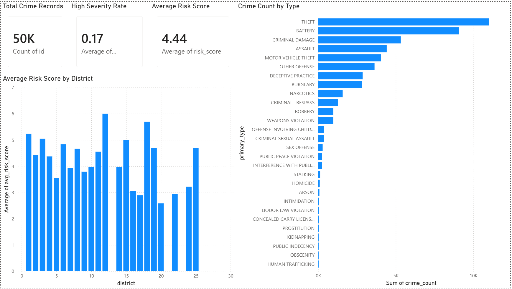
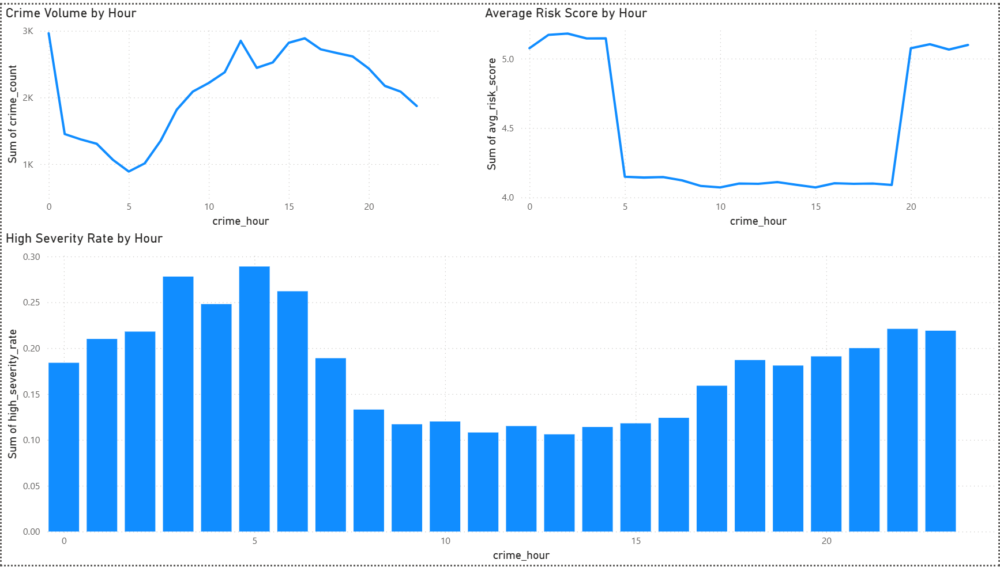
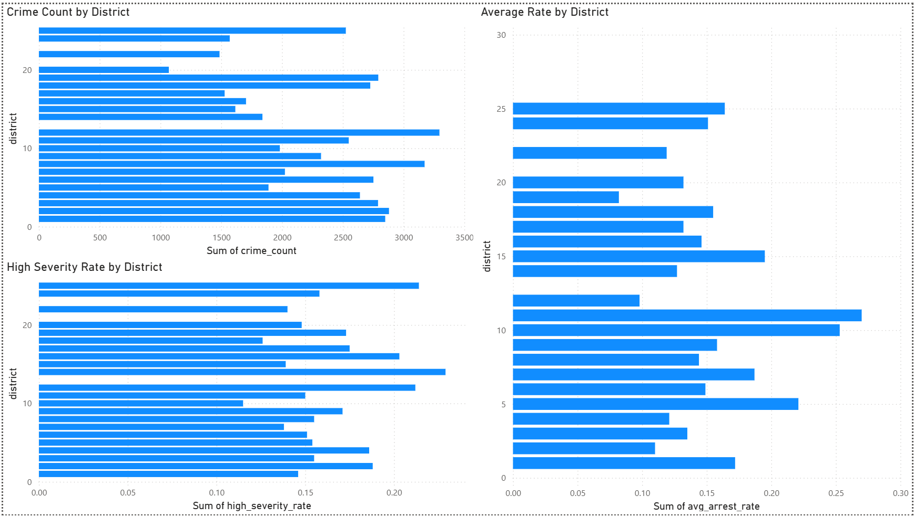
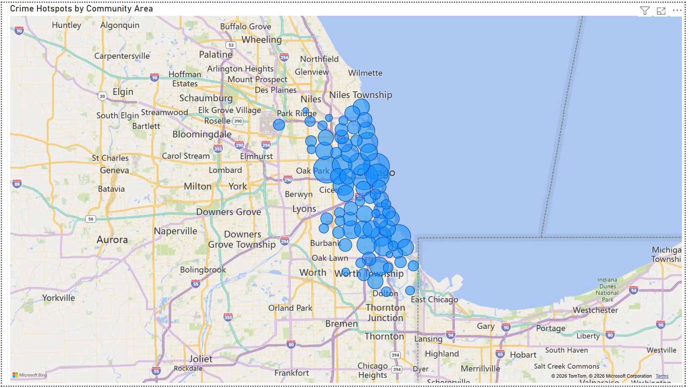
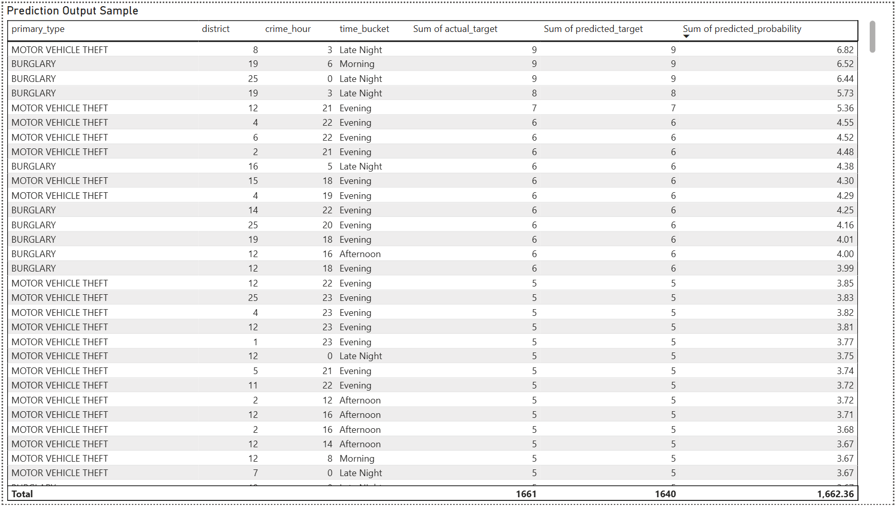

# Urban Safety Intelligence Platform

> End-to-end data pipeline to analyze and predict crime risk using real-world public safety data from the Chicago Open Data API.

    

---

## Overview

This project builds an end-to-end data pipeline to analyze and predict crime risk using real-world public safety data from the Chicago Open Data API. It integrates scalable data engineering, modern data processing frameworks, and machine learning to generate actionable insights for urban safety.

The system identifies high-risk areas and time patterns, enabling data-driven decision-making for public safety analysis.

---

## Key Highlights

- API-based ingestion of real-world crime data (50K+ records)
- Dual ETL pipelines using PySpark and Polars
- Feature engineering for spatiotemporal risk analysis
- Machine learning model for predicting high-severity incidents
- Interactive Power BI dashboard with geospatial insights

---

## Architecture

```
Chicago Open Data API
        ↓
Raw Data (CSV)
        ↓
ETL Pipelines
   ├── PySpark  (Scalable distributed processing)
   └── Polars   (High-performance local processing)
        ↓
Feature Engineering
        ↓
Machine Learning Model
        ↓
Curated Data Outputs
        ↓
Power BI Dashboard
```

---

## Tech Stack

| Category | Tools |
|---|---|
| Programming | Python |
| Data Engineering | PySpark, Polars |
| Machine Learning | Scikit-learn (Random Forest) |
| Data Processing | Pandas |
| Visualization | Power BI |
| Data Source | Chicago Open Data API |

---

## Project Structure

```
urban-safety-analytics/
│
├── data/
│   ├── raw/
│   ├── processed/
│   └── curated/
│
├── src/
│   ├── ingestion/
│   ├── spark/
│   ├── polars/
│   ├── features/
│   ├── models/
│   └── export/
│
├── outputs/
│   ├── predictions.csv
│   ├── feature_importance.csv
│   └── reports/
│
├── dashboard/
│   └── powerbi_dashboard.pbix
│
└── README.md
```

---

## Data Pipeline

### 1. Data Ingestion
- Extracts crime data via API
- Filters recent records with valid geolocation

### 2. Data Processing
- PySpark pipeline for scalable transformations
- Polars pipeline for optimized local processing

### 3. Feature Engineering
- Time-based features (hour, day, month)
- Spatial features (district, community area)
- Risk indicators (high-risk time, severity score)

### 4. Machine Learning
- Binary classification: high-severity vs low-severity crimes
- Model: Random Forest
- Train/test split with evaluation metrics

---

## Model Performance

| Metric | Score |
|---|---|
| Accuracy | 99.79% |
| F1 Score | 99.36% |

**Confusion Matrix:**

```
[[8339    0]
 [  21 1640]]
```

---

## Dashboard Features (Power BI)

| Panel | Description |
|---|---|
| Executive Overview | Total crime records, average risk score, high-severity rate |
| Time Analysis | Crime distribution by hour, risk trends |
| District Analysis | Crime volume, risk score, severity rates |
| Hotspot Map | Geospatial visualization of crime density |
| Model Insights | Predictions and feature importance |

---

## Dashboard Preview

### Executive Overview


### Time Analysis


### District Analysis


### Hotspot Map


### Model Predictions


## Key Insights

- Crime peaks during late evening and night hours
- Certain districts consistently show higher risk
- High-severity incidents correlate with time and location
- Clear hotspot regions identified through spatial clustering

---

## How to Run

**1. Install dependencies**

```bash
pip install -r requirements.txt
```

**2. Run the pipeline**

```bash
python src/ingestion/download_chicago_data.py
python src/polars/polars_pipeline.py
python src/features/feature_engineering.py
python src/models/risk_model.py
python src/export/export_powerbi.py
```

---

## Notes

- Raw data is not included due to size constraints
- API-based ingestion ensures reproducibility
- `.env` file is excluded for security

---

## Future Improvements

- Multi-city crime comparison
- Time-series forecasting
- Real-time data pipeline
- Web dashboard deployment
- Advanced anomaly detection

---

## Author

**Arvind Mahendran**

---

## Conclusion

This project demonstrates a complete data engineering and machine learning workflow, combining scalable processing, modern data tools, and real-world datasets to generate meaningful public safety insights.
